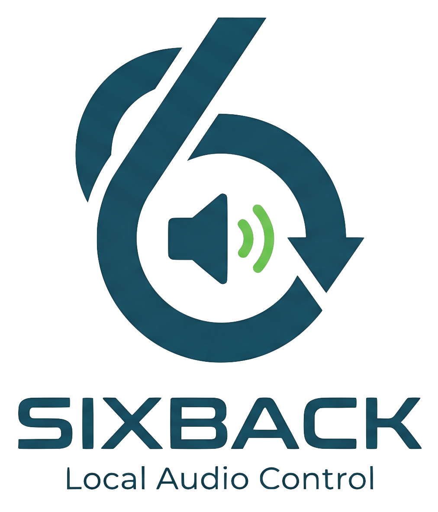

<p align="center">
  
</p>

# SixBack

> *Bring your six back.*

A tiny ESP32 stick that brings back the six Internet-radio preset buttons on
**Bose SoundTouch** speakers after Bose shut down their cloud
(2026-05-06).  It speaks just enough of the BMX cloud protocol that the
speaker firmware — which can no longer be updated — happily keeps working.

No subscription, no account, no Bose servers.  One USB stick on your LAN.

> SixBack was formerly developed and published as *BoseFix32*.  All
> functionality is preserved; the rename reflects the project's identity
> independent of any Bose trademark.

## Status (v0.8.3)

| Component                                                            | State                                                                                                              |
| -------------------------------------------------------------------- | ------------------------------------------------------------------------------------------------------------------ |
| Cloud replacement (`/bmx/registry`, `/streaming/…`, `/updates/…`)    | working — 22 / 30 ueberboese-spec endpoints served                                                                 |
| **Spotify trigger (S3 / C3 / C6)** (v0.7.7)                          | working — bind any preset slot to a `spotify:track/album/playlist:...` URI; physical button press fires Spotify Web-API `/play` to the speaker as a Connect device; one-time OAuth flow in WebUI; UI shows live trigger log with 🎵-badges per slot |
| **Marge keep-alive** (v0.7.7)                                        | working — 60s background ping of `/setMargeAccount` to every known speaker; prevents the scmudc event-stream from going silent after hours of idle |
| **Marge pair-bootstrap** (`/setMargeAccount` round-trip)             | working — `/streaming/account/{a}/device/` echoes deviceid with Bearer-credentials                                 |
| **scmudc telemetry** — per-device NowPlaying + event trace           | working — body-captured `/v1/scmudc/{deviceId}` JSON parsed into per-speaker store                                 |
| TuneIn preset resolver (`Tune.ashx` + `Describe.ashx`)               | working — stations show with correct name & artwork                                                                |
| Preset push to speaker — serialized FreeRTOS queue (v0.6.0)          | working — single persistent worker drains pushes one-by-one; depth 16, 503 when full                               |
| **Preset-loss defense** (Defense-in-Depth)                           | working — `handleMigrate` pre-imports; `/presets` and `account/full` return 404 when store empty; TUNEIN source-block carries `username=TuneIn` so `sourceAccount` survives every sync |
| **Opaque-source passthrough** — DLNA / UPnP / Bluetooth presets      | working — original `<ContentItem>` captured at import and replayed 1:1; `STORED_MUSIC` and `STORED_MUSIC_MEDIA_RENDERER` declared in `accountSources`; serialized as Bosman-schema `<preset>` blocks with `<location>` + `<source>` reference (v0.6.537) |
| **DLNA preset workflow** end-to-end                                  | working — verified on SoundTouch 30 with 6/6 OPAQUE slots reboot-persistent (2026-05-21)                           |
| **DLNA browse** in the WebUI (v0.8.0)                                | working — sidebar tab with speaker + server pickers, breadcrumb, drag-track-onto-slot; UPnP ContentDirectory:Browse SOAP runs in a small Pi5/Apache-fronted proxy so the firmware stays thin; tested against MiniDLNA, Fritz!Mediaserver |
| **DLNA preset recording** via drag-to-slot (v0.8.0)                  | working — `POST /api/speaker/{id}/dlna/preset/{slot}` emulates long-press (`/select` STORED_MUSIC ContentItem → 8 s settle → `/key` press+release) then re-imports `/presets` so the new OPAQUE slot is captured into the store with its `rawContentItem`; peer-aware refuse (HTTP 409) when the speaker is owned by another SixBack |
| **Migrate / Reboot progress modal** (v0.8.0)                         | working — both speaker actions open the same step-by-step progress dialog used by Refresh; status transitions are tracked by polling `/api/speakers`, with explicit timeout + last-status surfacing if the speaker never returns |
| Speaker telnet bootstrap (`sys configuration …` via TCP 17000)       | working                                                                                                            |
| **Migrate verify post-boot** (v0.7.632)                              | working — second `getpdo` after `waitForSpeakerBack_`; mismatch → `MIGRATE_FAILED` instead of silent `MIGRATED`    |
| Auto-import existing presets via BMX `/presets`                      | working                                                                                                            |
| **Stereo-Pair / Multi-Room group API**                               | working — POST/PUT/DELETE on `/streaming/account/{a}/group/`, NVS-persistent                                       |
| **Auto-Mode** — discover + migrate + preserve presets on first boot  | working — gated by NVS flag, default on                                                                            |
| **Auto-Mode cron** — periodic re-check every 30 min when enabled     | working — light discovery + auto-claim/release + migrate newcomers                                                 |
| **Peer-aware Auto-Mode** (v0.7.5)                                    | working — HTTP-probes other SixBack sticks in the LAN; skips speakers already claimed by a peer; UI shows `claimed by peer @ <ip>` |
| **Source-Normalizer** — TuneIn / Local / RadioBrowser → playable     | working — RadioBrowser UUID resolved via radio-browser.info                                                        |
| **IP-Failsafe** — auto-remigrate on ESP-IP change, with pre-probe    | working — skips speakers already on the new base                                                                   |
| **SETTLING status** (v0.6.541)                                       | working — backend reports `settling` instead of `offline` when only Telnet:17000 is down but BMX:8090 still answers |
| Preset UI — drag&drop, dual-row (HW vs Store), per-slot revert       | working — modal progress, per-speaker export/import, refresh discards unsaved (v0.7.3)                             |
| Diagnostic snapshot (v0.6.0)                                         | working — `GET /api/speaker/{id}/diagnostic-snapshot` + one-shot pre-migrate snapshot persisted to `/snapshots/{deviceId}.json`; WebUI download or "Send to maintainer" upload to `sixback.io/snapshots/bosefix/snapshot` |
| OTA — app & LittleFS                                                 | working — `UPDATE_SIZE_UNKNOWN` + stream-to-EOF + 90% sanity-abort (v0.7.0 fix for HTTPS Content-Length truncation) |
| **OTA install — self-validating + clear status** (v0.8.3)            | working — the *Install* action re-checks the manifest itself instead of gating on a stale prior check, so a legitimate update is never blocked by a misleading "no update available"; distinct messages for *server unreachable* (retry) vs *already up-to-date* (use Force re-install); the WebUI panel always reflects the real state, so an error can no longer sit next to a stale "available" |
| **Tag-based release versioning** (v0.7.6)                            | working — `RELEASE_TAG` env bakes the same version string into all four target firmwares; eliminates multi-target build-drift |
| **Build size-gate** (v0.7.5)                                         | working — `build_release.sh` aborts if any firmware or LittleFS image exceeds its partition slot                   |
| **Asymmetric OTA partition** (C3 / C6, v0.7.7)                       | working — app0 = 2.5 MB (full SixBack incl. Spotify), app1 = 1 MB recovery slot (currently empty); spiffs 384 KB; **new install needs USB-flash** (image too large for old 1.81 MB slots) |
| WiFi provisioning — Improv-Serial (idle-window) + Captive AP         | working — both armed in parallel on cold boot                                                                      |
| **ESP32-C6 WPA2 reliability**                                        | working — `WiFi.setSleep(WIFI_PS_NONE)` + `setAutoReconnect(true)` applied **before** `WiFi.begin()`; closes 4-Way-Handshake-Timeout on WPA2-Mixed APs |
| System health — Task-WDT, WiFi / heap watchdog, crash counter, self-ping | working                                                                                                        |
| Builds for **ESP32-S3 ★ / ESP32-C3 / ESP32-C6**                      | working — S3 is the recommended target; ESP32-classic temporarily dropped from v0.8.0 (Web-UI growth exceeded the 256 KB spiffs slot in `partitions-4mb.csv` — followup will rebalance the symmetric 4 MB layout) |
| ESP-Web-Tools landing page (auto-detects chip)                       | working — <https://sixback.io/>                                                                                    |

## Install (recommended)

Open the **web flasher** in Chrome or Edge desktop and click *Connect*:

> 🔗 **<https://sixback.io/>**

The page reads [`webflasher/manifest.json`](webflasher/manifest.json),
detects the chip family of the connected board, and writes the matching
factory image — bootloader + partition table + firmware + Web UI — in a
single shot.  Right after the flash, esp-web-tools also offers to hand
over WiFi credentials via Improv-Serial.

If Web Serial is unavailable, every target also ships an
`*-firmware.bin` (for OTA over WiFi) and `*-littlefs.bin` (for FS-OTA).

### ⚠ Auto-migration runs by default

A freshly-flashed device boots with **`auto_migrate_on_boot = true`** in NVS.
Once it is on your WiFi, it will:

1. Discover all SoundTouch speakers on the LAN (SSDP + ARP-probe).
2. For every eligible speaker (model whitelist `SoundTouch 10/20/30`,
   firmware whitelist `27.0.6.x` and `27.0.3.x`):
   - Read its current presets via the BMX API.
   - Normalize each preset (TuneIn passthrough; RADIO_BROWSER converted
     to a direct stream URL; DLNA / Bluetooth captured as opaque
     `<ContentItem>` and replayed 1:1).
   - Rewrite the speaker's cloud URLs via Telnet `:17000`.
   - Reboot the speaker; presets survive without long-press because the
     normalized list is embedded in the speaker's `account/full` sync.

If you'd rather drive each migration by hand, **turn the switch off at
the very top of `http://sixback.local/`** *before* the device finds your
speakers — or pre-disable it via `PUT /api/auto-mode` (Body:
`{"enabled":false}`).  The default is "on" because the typical install
path is *flash → provision → presets work*, and the foot-gun guards
(eligibility whitelists, `max_per_boot=4`) are tight enough that nothing
unrelated on your LAN gets touched.

After the initial boot pass, SixBack keeps the auto-mode pipeline alive
as a **periodic cron** (default every 30 minutes, configurable via
`cron_interval_s`).  Each tick does a light discovery (SSDP + known-IP
probe, no full `/24` sweep), runs Auto-Claim/Release on the inventory
(so a speaker that someone else migrated away gets dropped from the
"owned" list automatically), and migrates any newcomer that matches the
eligibility whitelist.  The countdown to the next tick is visible at the
top of the Web UI.

If multiple SixBack sticks coexist on the same LAN, the peer-aware
auto-mode (v0.7.5+) keeps them from fighting over the same speakers:
each stick HTTP-probes any foreign cloud URL it sees, and if the response
looks like another SixBack instance the speaker is left to its current
owner.  The UI labels such speakers as *claimed by peer @ &lt;ip&gt;*.

<p align="center">
  
</p>

The top of `http://sixback.local/` is where the **Auto-Migrate at Boot**
switch lives.  Below it every discovered speaker gets a card with its
current state (migrated / settling / original / foreign-cloud / offline),
its 6 preset slots, and per-speaker actions (migrate, revert, reboot,
edit presets, group sync).

## WiFi provisioning — two paths in parallel

On every cold boot the device opens **two** parallel provisioning
windows.  Whichever finishes first wins; the other is torn down.
Same pattern as the sister project [ip4knx / TUL KNX-Gateway](https://github.com/tostmann/ip4knx).

| Path           | When                                         | Window                                        |
| -------------- | -------------------------------------------- | --------------------------------------------- |
| Improv-Serial  | always                                       | 30 s idle (with creds) / 120 s idle (without) |
| Captive AP     | no NVS creds **or** STA-connect timeout      | 5 min idle                                    |

The **Improv** path is what esp-web-tools uses right after flashing.
The **Captive Portal** opens an **open** AP called `SixBack-XXYYZZ`
(no password) with a DNS hijack so any phone connecting to it gets the
WiFi-setup form automatically; after the user submits, the success
page auto-redirects to the device's freshly assigned LAN IP via
`<meta http-equiv="refresh">`.

## Supported hardware

| Chip          | Board reference                  | Flash | Notes                                                            |
| ------------- | -------------------------------- | ----- | ---------------------------------------------------------------- |
| **ESP32-S3 ★**| `esp32-s3-devkitc-1` (N16R8V)    | 16 MB | **recommended** — 8 MB PSRAM, mature WiFi 5 stack, comfortable flash headroom |
| ESP32         | `esp32dev` (DevKitC-1)           | 4 MB  | classic — source build works; **not shipped in v0.8.0** while the symmetric 4 MB partition layout (1.81 MB app slots, 256 KB spiffs) gets rebalanced to fit the grown Web UI |
| ESP32-C3      | `esp32-c3-devkitm-1`             | 4 MB  | flashes over the chip's built-in USB-Serial-JTAG                 |
| ESP32-C6      | `esp32-c6-devkitc-1`             | 4 MB  | WiFi 6 — works, but cold-start discovery occasionally drops SSDP-multicast packets and rare HTTP-server hangs need a reset |

**S3 is the recommended target for distribution.** During the 4-phase
end-to-end test (S3 ↔ C6 ping-pong with full erase/flash/provision each
round) the S3 hit 3/3 speakers discovered + migrated in every single
auto-mode run, while the C6 needed a second boot in one cold-start case
and produced one HTTP-server hang that recovered only after a hardware
reset.  The extra ~5 € for an S3-DevKitC-1-N16R8 buys noticeable
robustness and ~40 % free flash for future features.

C3 and C6 are fully functional and stay built/published on every release;
both sit at ~52 % flash use under v0.8.0 (single-app no-OTA layout, 3.5 MB
slot, ~1.75 MB image).  ESP32-classic builds from source but is not
published in v0.8.0 — the symmetric 4 MB layout's 256 KB spiffs slot can
no longer hold the gzipped Web UI plus the Spotify-trigger silence stub;
a follow-up will rebalance partitions.

All four targets share the same source tree and the same Web UI; the
PlatformIO `extends = common` mechanism keeps the per-target diff small
([`platformio.ini`](platformio.ini)).

## What it does on the speaker

After clicking *Migrate* in the Web UI, SixBack talks to the Bose
Diagnostic Shell on **TCP&nbsp;:17000** of the speaker and rewrites the
cloud URLs the firmware caches in NVS:

```
sys configuration bmxRegistryUrl http://<sixback-ip>:8000/bmx/registry/v1/services
sys configuration statsServerUrl http://<sixback-ip>:8000
sys configuration margeServerUrl http://<sixback-ip>:8000
sys configuration swUpdateUrl    http://<sixback-ip>:8000/updates/soundtouch
envswitch boseurls set http://<sixback-ip>:8000 http://<sixback-ip>:8000/updates/soundtouch
sys reboot
```

No SSH, no firmware mod, no Bose login.  The change is fully reversible
via *Revert to original Bose* — the speaker returns to its factory URL
set even though the original cloud is offline.

## Build locally

Requires PlatformIO and a Linux/macOS host.

```bash
# build everything (all four targets) + LittleFS images
pio run -e esp32 -e s3 -e c3 -e c6
pio run -e esp32 -e s3 -e c3 -e c6 -t buildfs

# produce tagged factory images + manifest for the web flasher
./scripts/build_release.sh v0.7.6     # tag arg bakes the version into all 4 firmwares

# flash a single target via USB
pio run -e s3 -t upload
pio run -e s3 -t uploadfs
```

Versioning + build snapshots are automatic
(see [`scripts/version_bump.py`](scripts/version_bump.py)): every local
build snapshots the working tree before bumping `build_number.txt`, so
you can always roll back to the exact state a given binary was built
from.  Those snapshot commits stay **local** — only tagged releases are
pushed to the public repo.

## Repository layout

```
src/                  Firmware (Arduino + ESP-IDF mix)
web-src/              Web UI source (index.html, gzipped at build time
                      into data/ for LittleFS)
webflasher/           esp-web-tools landing page + manifest (binaries
                      are .gitignored — rebuild via build_release.sh)
images/               README assets — title PNG + Web-UI screenshot
scripts/              version_bump pre-build hook + build_release.sh
partitions.csv        16 MB partition table  (ESP32-S3 16-MB modules)
partitions-4mb.csv    4 MB partition table   (ESP32 / C3 / C6)
platformio.ini        Multi-env config, see `[common]` + `[env:*]`
```

## Acknowledgements

- **[julius-d/ueberboese-api](https://github.com/julius-d/ueberboese-api)** —
  OpenAPI specification of the legacy Bose SoundTouch streaming cloud,
  reconstructed from observed traffic. It is SixBack's verifiable
  ground-truth for endpoint shapes, header semantics, and event-body
  formats (scmudc envelope, NowPlaying structure, kebab-case event
  types, group/preset XML).  Thanks to **julius-d** for publishing it.

- **[tostmann/ip4knx](https://github.com/tostmann/ip4knx)** — sister
  project. The dual-path WiFi provisioning (Improv + Captive in
  parallel) and the system-health / self-ping watchdog pattern are
  carried over from there.

## Disclaimer

SixBack is an independent open-source project.  It is **not** affiliated
with, endorsed by, or sponsored by Bose Corporation.  All references to
Bose products and protocols are nominative, for interoperability with
hardware their owners have already paid for.  Use at your own risk.

## Licence

[PolyForm Noncommercial 1.0.0](https://polyformproject.org/licenses/noncommercial/1.0.0).
See [LICENSE](LICENSE) for the full text and
[THIRD-PARTY-LICENSES.md](THIRD-PARTY-LICENSES.md) for upstream
component licences.
