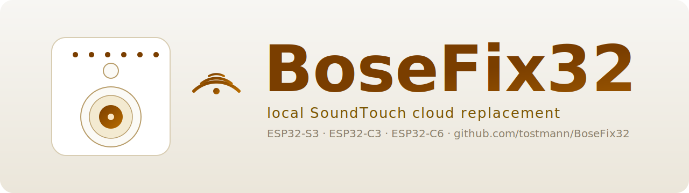

<p align="center">
  
</p>

# BoseFix32

A tiny ESP32 stick that brings back the Internet-radio preset buttons on
**Bose SoundTouch** speakers after Bose shut down their cloud
(2026-05-06).  It speaks just enough of the BMX cloud protocol that the
speaker firmware — which can no longer be updated — happily keeps working.

No subscription, no account, no Bose servers.  One USB stick on your LAN.

## Status

| Component                                                          | State                                                |
| ------------------------------------------------------------------ | ---------------------------------------------------- |
| Cloud replacement (`/bmx/registry`, `/streaming/…`, `/updates/…`)  | working                                              |
| TuneIn preset resolver (`Tune.ashx` + `Describe.ashx`)             | working — stations show with correct name & artwork  |
| Preset push to speaker (long-press emulation)                      | working                                              |
| Speaker telnet bootstrap (`sys configuration …` via TCP 17000)     | working                                              |
| Auto-import existing presets via BMX `/presets`                    | working                                              |
| **Auto-Mode** — discover + migrate + preserve presets on first boot | working — gated by NVS flag, default on             |
| **Auto-Mode cron** — periodic re-check every 10 min when enabled    | working — light discovery + auto-claim/release + migrate newcomers |
| **Source-Normalizer** — TuneIn / Local / RadioBrowser → playable   | working — RadioBrowser UUID resolved via radio-browser.info |
| **IP-Failsafe** — auto-remigrate on ESP-IP change, with pre-probe   | working — skips speakers already on the new base     |
| Auto-Claim + Auto-Release symmetry on the inventory                | working — owned-by-us flips both ways on refresh     |
| Web UI (English, mobile-friendly) with Auto-Mode toggle at top     | working                                              |
| OTA — app & LittleFS                                               | working                                              |
| System health — Task-WDT, WiFi / heap watchdog, crash counter, self-ping | working                                        |
| WiFi provisioning — Improv-Serial (idle-window) + Captive AP       | working — both armed in parallel on cold boot        |
| Builds for **ESP32 / ESP32-S3 ★ / ESP32-C3 / ESP32-C6**            | working — S3 is the recommended target               |
| ESP-Web-Tools landing page (auto-detects chip)                     | working — <https://install.busware.de/bosefix/>      |

## Install (recommended)

Open the **web flasher** in Chrome or Edge desktop and click *Connect*:

> 🔗 **<https://install.busware.de/bosefix/>**

The page reads [`webflasher/manifest.json`](webflasher/manifest.json),
detects the chip family of the connected board, and writes the matching
factory image — bootloader + partition table + firmware + Web UI — in a
single shot.  Right after the flash, esp-web-tools also offers to hand
over WiFi credentials via Improv-Serial.

If Web Serial is unavailable, every target also ships an
`*-firmware.bin` (for OTA over WiFi) and `*-littlefs.bin` (for FS-OTA).

### ⚠ Auto-migration runs by default

A freshly-flashed device boots with **`auto_migrate_on_boot = true`** in NVS.
Once it is on your WiFi, it will:

1. Discover all SoundTouch speakers on the LAN (SSDP + ARP-probe).
2. For every eligible speaker (model whitelist `SoundTouch 10/20/30`,
   firmware whitelist `27.0.6.x` and `27.0.3.x`):
   - Read its current presets via the BMX API.
   - Normalize each preset (TuneIn passthrough; RADIO_BROWSER converted
     to a direct stream URL; unsupported sources marked abandoned).
   - Rewrite the speaker's cloud URLs via Telnet `:17000`.
   - Reboot the speaker; presets survive without long-press because the
     normalized list is embedded in the speaker's `account/full` sync.

If you'd rather drive each migration by hand, **turn the switch off at
the very top of `http://bosefix.local/`** *before* the device finds your
speakers — or [pre-disable via `PUT /api/auto-mode`](docs/CONFIGURATION.md).
The default is "on" because the typical install path is *flash → provision
→ presets work*, and the foot-gun guards (eligibility whitelists,
`max_per_boot=4`) are tight enough that nothing unrelated on your LAN
gets touched.

After the initial boot pass, BoseFix32 keeps the auto-mode pipeline alive
as a **periodic cron** (default every 10 minutes, configurable via
`cron_interval_s`).  Each tick does a light discovery (SSDP + known-IP
probe, no full `/24` sweep), runs Auto-Claim/Release on the inventory
(so a speaker that someone else migrated away gets dropped from the
"owned" list automatically), and migrates any newcomer that matches the
eligibility whitelist.  The countdown to the next tick is visible at the
top of the Web UI.

<p align="center">
  
</p>

The top of `http://bosefix.local/` is where the **Auto-Migrate at Boot**
switch lives.  Below it every discovered speaker gets a card with its
current state (migrated / original / foreign-cloud / offline), its 6
preset slots, and per-speaker actions (migrate, revert, reboot, edit
presets, group sync).

## WiFi provisioning — two paths in parallel

On every cold boot the device opens **two** parallel provisioning
windows.  Whichever finishes first wins; the other is torn down.
Same pattern as the sister project [ip4knx / TUL KNX-Gateway](https://github.com/tostmann/ip4knx).

| Path           | When                                         | Window                                        |
| -------------- | -------------------------------------------- | --------------------------------------------- |
| Improv-Serial  | always                                       | 30 s idle (with creds) / 120 s idle (without) |
| Captive AP     | no NVS creds **or** STA-connect timeout       | 5 min idle                                    |

The **Improv** path is what esp-web-tools uses right after flashing.
The **Captive Portal** opens an **open** AP called `BoseFix32-XXYYZZ`
(no password) with a DNS hijack so any phone connecting to it gets the
WiFi-setup form automatically; after the user submits, the success
page auto-redirects to the device's freshly assigned LAN IP via
`<meta http-equiv="refresh">`.

## Supported hardware

| Chip          | Board reference                  | Flash | Notes                                                            |
| ------------- | -------------------------------- | ----- | ---------------------------------------------------------------- |
| **ESP32-S3 ★**| `esp32-s3-devkitc-1` (N16R8V)    | 16 MB | **recommended** — 8 MB PSRAM, mature WiFi 5 stack, comfortable flash headroom (~52 % used) |
| ESP32         | `esp32dev` (DevKitC-1)           | 4 MB  | classic — biggest hobby installed base; external USB-UART        |
| ESP32-C3      | `esp32-c3-devkitm-1`             | 4 MB  | flashes over the chip's built-in USB-Serial-JTAG                 |
| ESP32-C6      | `esp32-c6-devkitc-1`             | 4 MB  | WiFi 6 — works, but in extended testing showed occasional SSDP-multicast loss on cold-start discovery and rare HTTP-server hangs that needed a reset |

**S3 is the recommended target for distribution.** During the 4-phase
end-to-end test (S3 ↔ C6 ping-pong with full erase/flash/provision each
round) the S3 hit 3/3 speakers discovered + migrated in every single
auto-mode run, while the C6 needed a second boot in one cold-start case
and produced one HTTP-server hang that recovered only after a hardware
reset.  The extra ~5 € for an S3-DevKitC-1-N16R8 buys noticeable
robustness and ~40 % free flash for future features.

The other three targets are fully functional and stay built/published on
every release — the C3 and C6 currently sit at ~90 % flash use, so
adding heavy features needs care.

All four targets share the same source tree and the same Web UI; the
PlatformIO `extends = common` mechanism keeps the per-target diff small
([`platformio.ini`](platformio.ini)).

## What it does on the speaker

After clicking *Migrate* in the Web UI, BoseFix32 talks to the Bose
Diagnostic Shell on **TCP&nbsp;:17000** of the speaker and rewrites the
cloud URLs the firmware caches in NVS:

```
sys configuration bmxRegistryUrl http://<bosefix-ip>:8000/bmx/registry/v1/services
sys configuration statsServerUrl http://<bosefix-ip>:8000
sys configuration margeServerUrl http://<bosefix-ip>:8000
sys configuration swUpdateUrl    http://<bosefix-ip>:8000/updates/soundtouch
envswitch boseurls set http://<bosefix-ip>:8000 http://<bosefix-ip>:8000/updates/soundtouch
sys reboot
```

No SSH, no firmware mod, no Bose login.  The change is fully reversible
via *Revert to original Bose* — the speaker returns to its factory URL
set even though the original cloud is offline.

## Build locally

Requires PlatformIO and a Linux/macOS host.

```bash
# build everything (all four targets) + LittleFS images
pio run -e esp32 -e s3 -e c3 -e c6
pio run -e esp32 -e s3 -e c3 -e c6 -t buildfs

# produce factory images + manifest for the web flasher
./scripts/build_release.sh

# flash a single target via USB
pio run -e s3 -t upload
pio run -e s3 -t uploadfs
```

Versioning + build snapshots are automatic
(see [`scripts/version_bump.py`](scripts/version_bump.py)): every local
build snapshots the working tree before bumping `build_number.txt`, so
you can always roll back to the exact state a given binary was built
from.  Those snapshot commits stay **local** — only tagged releases are
pushed to the public repo.

## Repository layout

```
src/                  Firmware (Arduino + ESP-IDF mix, ~1.6 MB image)
data/                 Web UI (index.html) + Bose service descriptors
webflasher/           esp-web-tools landing page + manifest (binaries
                      are .gitignored — rebuild via build_release.sh)
images/               README assets — title SVG + Web-UI screenshot
scripts/              version_bump pre-build hook + build_release.sh
partitions.csv        16 MB partition table  (ESP32-S3 16-MB modules)
partitions-4mb.csv    4 MB partition table   (ESP32 / C3 / C6)
platformio.ini        Multi-env config, see `[common]` + `[env:*]`
```

## Disclaimer

BoseFix32 is an independent open-source project.  It is **not** affiliated
with, endorsed by, or sponsored by Bose Corporation.  All references to
Bose products and protocols are nominative, for interoperability with
hardware their owners have already paid for.  Use at your own risk.

## Licence

GPL-3.0-or-later for the firmware; per-file `SPDX-License-Identifier`
headers govern.  Full text:
<https://www.gnu.org/licenses/gpl-3.0.en.html>
